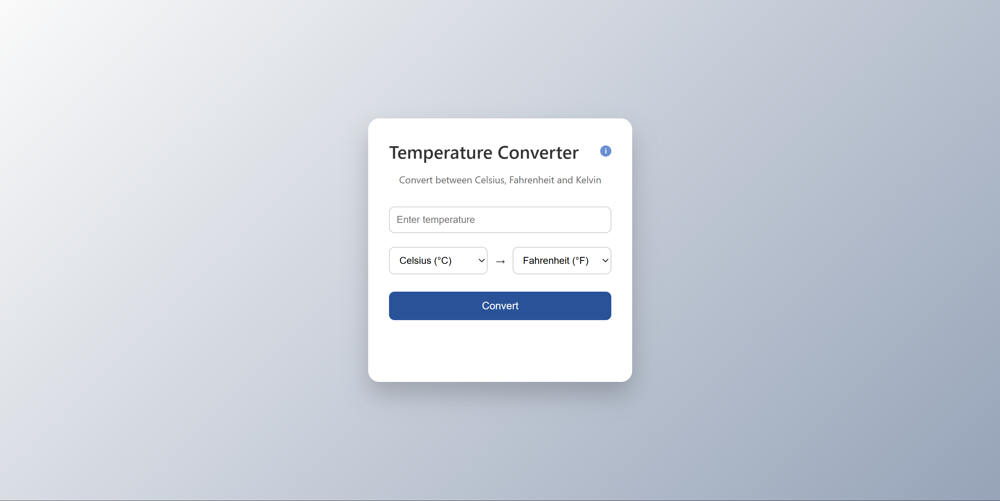

  

<h1 align="center">🌡️ Temperature Converter</h1>

A simple web application that converts temperatures between Celsius, Fahrenheit and Kelvin.

# 🌡️ Temperature Converter

A lightweight and user-friendly **temperature conversion web application** that allows users to quickly convert values between **Celsius, Fahrenheit, and Kelvin**.
The project demonstrates the use of **JavaScript for real-time calculations** combined with a clean and responsive interface built using HTML and CSS.

---

## 🚀 Features

* Convert **Celsius → Fahrenheit / Kelvin**
* Convert **Fahrenheit → Celsius / Kelvin**
* Instant temperature calculation
* Simple and intuitive user interface
* Responsive design for different screen sizes

---

## 🛠️ Technologies Used

* **HTML5** – structure of the application
* **CSS3** – styling and layout
* **JavaScript** – temperature conversion logic

---

## 📸 Preview

*(Screenshot of the application will be added here)*

---

## ▶️ Live Demo

You can try the project here:
**https://rohanrathodonline.github.io/Temperature-Converter/**

---

## 📂 Project Structure

Temperature-Converter
│
├── index.html → Main webpage
├── style.css → Application styling
├── script.js → Temperature conversion logic
└── README.md → Project documentation

---

## 📈 Future Improvements

* Add a **dark mode toggle**
* Improve UI animations
* Add input validation for better error handling

---

## 👨‍💻 Author

**Rohan Rathod**
